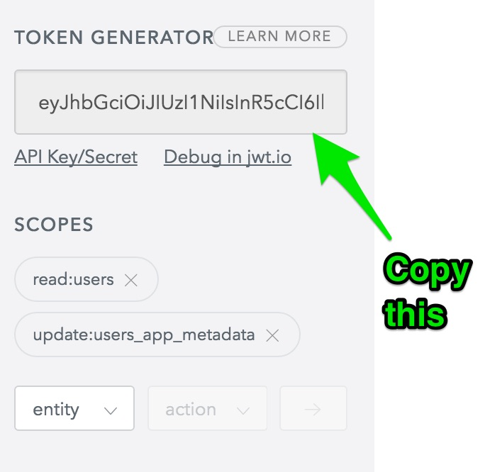
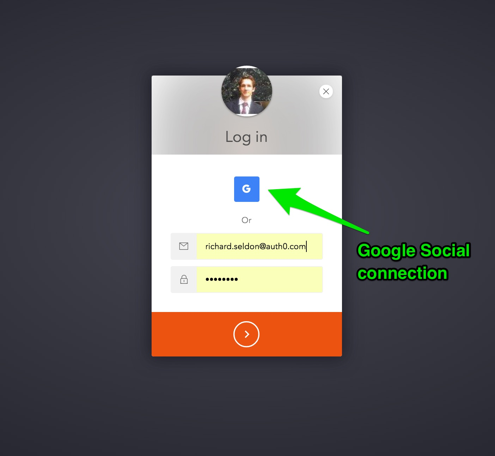
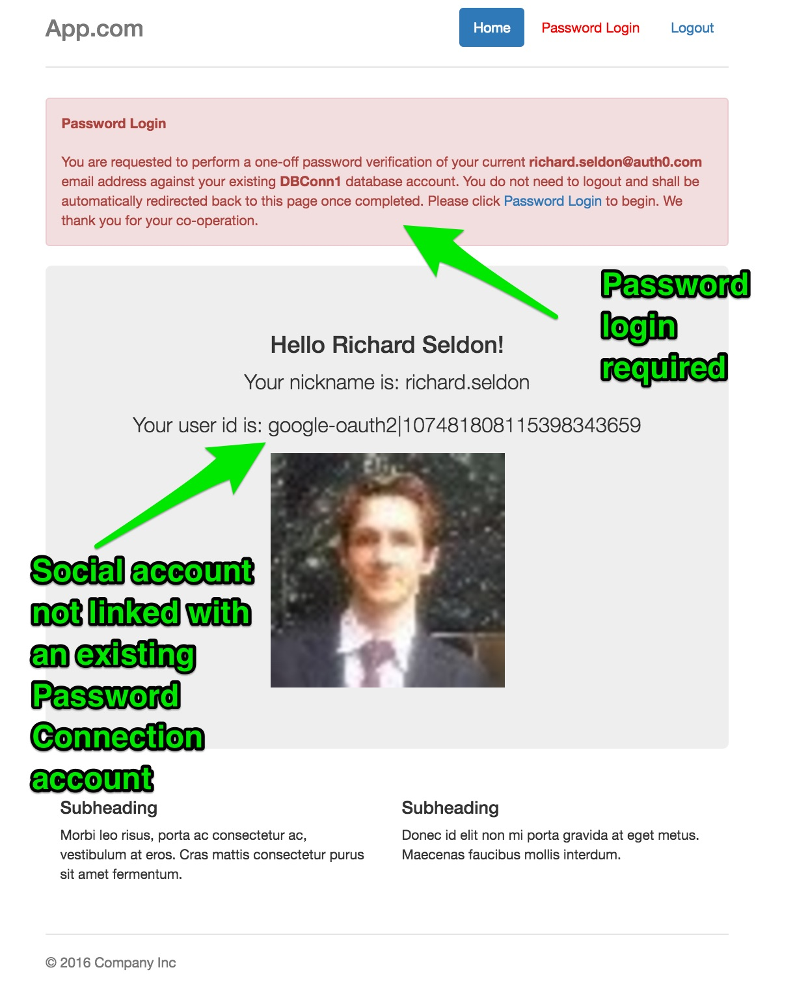
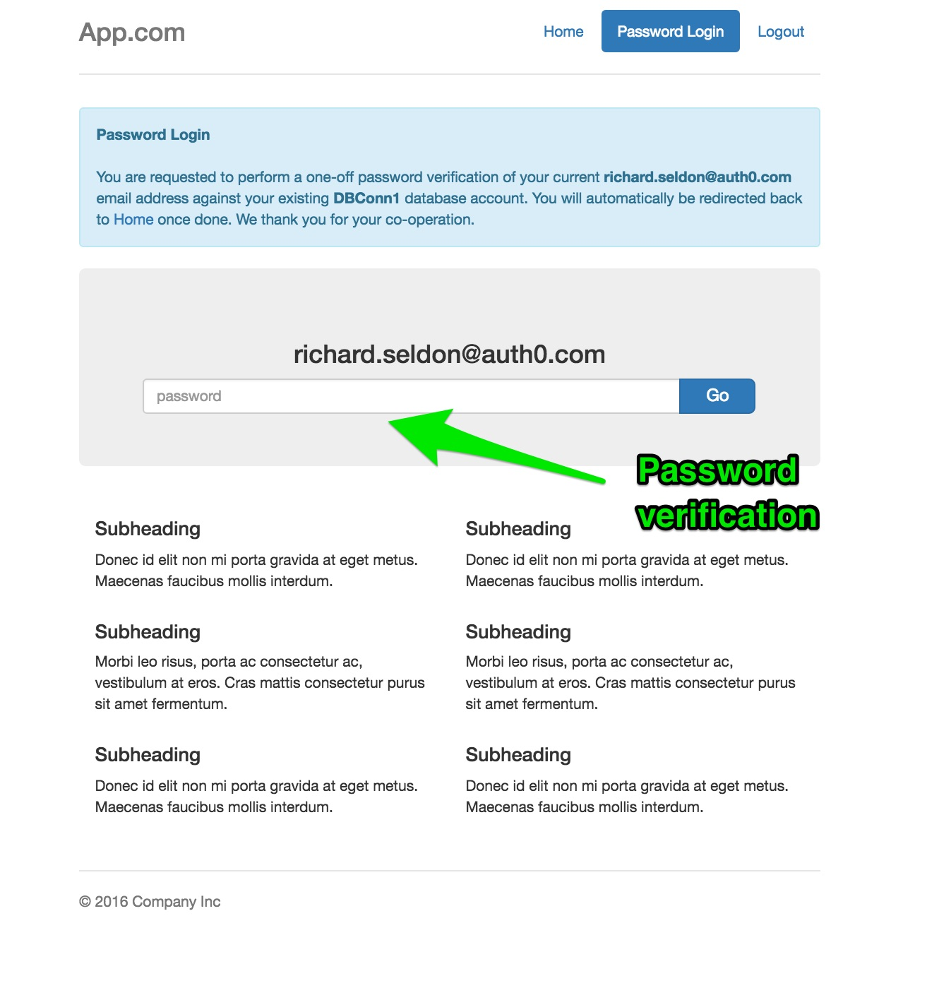
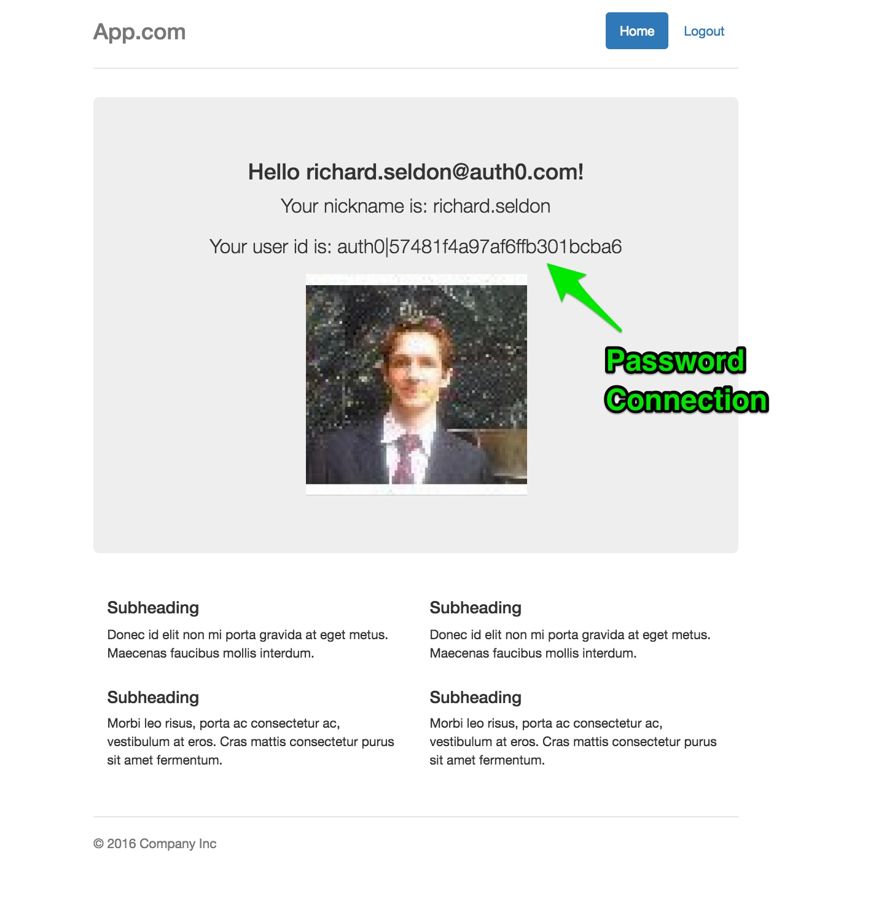
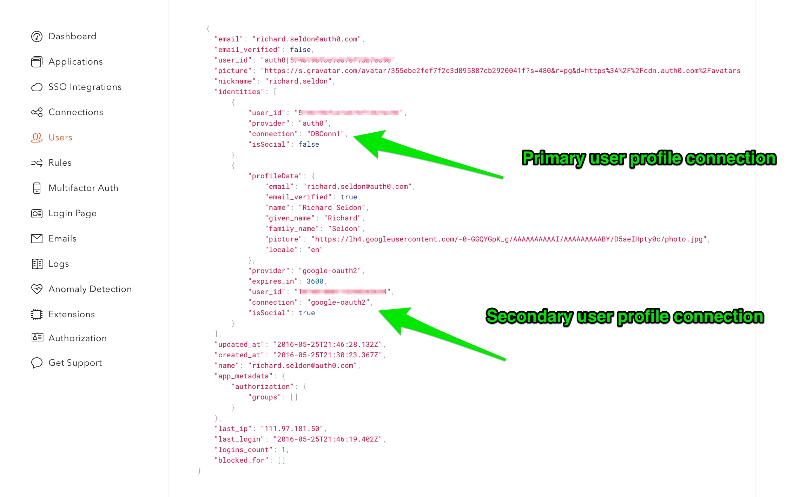

## Demonstrates using Auth0 (including Lock and Auth0.js) with Java Spring to create a Secured MVC Web Application

Extends this simpler [Auth0 Spring MVC Sample](https://github.com/auth0-samples/auth0-spring-mvc-sample) and demonstrates
Social and Connection Login and Database Account linking

This is a companion sample for the [Auth0 Spring MVC](https://github.com/auth0/auth0-spring-mvc) library.
Please refer to that library and documentation for further information specific to the library itself.

So you basically:

```
1) start with choice of login between Social Connection or Database Connection.
2) if you login using Social Connection and have not already linked you DB Connection then you are requested to do so.
```

### Background and Important Information

The idea behind this flow is that you have an application defined with two connection types. A social connection and
a database connection. We want to allow users that login in with their social connection to have the option to enter
their database connection password whilst logged in, and this will `link` their social connection with their `existing`
database connection. The database connection becomes the primary user profile, and the social connection then becomes a
secondary user profile. In the Auth0 dashboard you will notice after linking accounts, there is only a single user profile
remaining, and it contains user profile information for both connection types.

The database connection MUST have a user registered with an exact matching email address to the social connection
user you are using to test the account linking. THIS IS IMPORTANT. The application will automatically detect whether
a matching database connection profile exists. The idea behind this is that it is possible to correlate a social account with an
 existing database account (profile) by virtue of the fact each shares the same `email address` - AND the logged in social connection
 user has knowledge of the existing database user's password of course!

 Please also note that `account signup` is disabled - you can log in with a social connection without have already created an
 account, but the database connection must contain an existing user. You can optionally use the `Auth0` dashboard to set this up if
 using Auth0 database connection.

Here we have used an application that is not part of a Single Sign On (SSO) arrangement to simplify things. Also, the application
is configurable - you can choose the single social connection type you wish to use (google-oauth2, facebook, twitter etc), and
the single Database connection. See details later in this readme on variables configuration.

For the purposes of this readme and the screenshots, we are using `google-oauth2` social connection and a database connection
called `DBConn1`. Note, you could easily have an existing custom Database and use that as the database connection. Furthermore,
you could have this setup to migrate your users from the custom database to `Auth0` as users login with their database connection.
Note, logging in with a password when already logged in with a social connection will have the same effect as a plain database login
from the login page. In either instance, users could be migrated too (if you wish to use that configuration option using a custom database
connection).

You should be able to get everything set up and running in under 10 minutes. Enough talk, let's get started!


### Prerequisites

In order to run this example you will need to have `Java 8` and `Maven` installed. You can install Maven with [brew](http://brew.sh/):

```sh
brew install maven
```

Check that your maven version is 3.0.x or above:
```sh
mvn -v
```

This project relies upon `Spring Boot`.


Benefits of Spring Boot, in particular for traditional server-side web application / microservices architectures:

**Automatic configuration** - Spring Boot can automatically provide configuration for application functionality common to many Spring applications.

**Starter dependencies** - Tell Spring Boot what kind of functionality you need, and it will ensure that the libraries needed are added to the build.

**Command-line interface** - Optional feature of Spring Boot lets you write complete applications with just application code, but no need for a traditional
 project build.

**The Actuator** - Gives you insight into what's going on inside of a running Spring Boot application.


### Setup

Create an [Auth0 Account](https://auth0.com) (if not already done so - free!).


#### From the Auth0 Dashboard

Create an application - for the purposes of this sample - `app`

Ensure you add the following to the settings.

Allowed Callback URLs:

```
http://localhost:3099/callback
http://localhost:3099/plcallback
```

The project assumes this app is NOT part of an SSO arrangement so no logout URL needs
to be declared.

Now, please ensure you set up both a

```
Connection (Connections -> Database -> Create DB Connection)
Google Social Connection (Connections -> Social -> Google)
```

Both of these connection types NEED to be associated with the application you have created - `app`


Screenshot below of how this looks:


That's it for the Dashboard setup!


### Update configuration information

Enter your:

`client_id`, `client_secret`, `domain`, `managementToken`, `passwordConnection`, and `socialConnection` information into `src/main/resources/auth0.properties`


For the `managementToken` token, you shall need to visit our [management api page](https://auth0.com/docs/api/management/v2#!/Users/patch_users_by_id)

Ensure you select the following grants:


`update:users_app_metadata`

`read:users`

This is because for account linking we need update permission, and for reading user information on a specific
connection we need read users permission (to check if social user has a corresponding password connection)


Use our token management form to automatically generate the token, and copy the token created





For the `passwordConnection`, this the name of your database connection in the Auth0 Dashboard (whatever you named it) e.g `DBConn1`

For the `socialConnection`, this the name of your social connection in the Auth0 Dashboard.
These names are pre-ordained (you must use the given name of that social connection type).
Some common ones are `google-oauth2`, `facebook`, and `twitter`.


### Build and Run

In order to build and run the project you can simply execute the following using `maven`:

```sh
mvn spring-boot:run
```

Alternatively, you can build to an executable jar file and run as follows:

```sh
mvn clean package
```

```sh
java -jar target/auth0-spring-boot-sample-web-jsp-0.0.1-SNAPSHOT.jar
```


Then, go to [http://localhost:3099/login](http://localhost:3099/login).

---

### Here are some screenshots of the overall flow (minus the Growler notifications!):

In the screenshots, we follow a Google Social Account user who has logged in and has an
(verified via API call searching for same email address) existing Password Account which
is currently not associated with their Social Account.

For all other scenarios (logging in with Password Account, or else logging in with Social Account
for which no matching Password Account exists) then no `Password Login` prompts appear.

Please note that `auth0` offers two primary JavaScript (client side) libraries for UI authentication - `lock` and `auth0.js`.

The main login uses `Lock` and the `password login` for account linking the app uses `auth0.js` .


#### 1. Login




#### 2. Home - Social Account not linked with existing Password Connection Profile




#### 3. Password Login (and link accounts)




#### 4. Home - Social Account now linked with Password Connection Profile




#### 5. Auth0 Dashboard - Profile Info




Finally, in addition, using Spring Boot `actuator` we can easily verify various health and performance statistics for our running application.

Here are just a few of the available endpoints:

```
http://localhost:3099/metrics
http://localhost:3099/health
http://localhost:3099/mappings
http://localhost:3099/env
```

## License

The MIT License (MIT)

Copyright (c) 2016 AUTH0 LLC

Permission is hereby granted, free of charge, to any person obtaining a copy
of this software and associated documentation files (the "Software"), to deal
in the Software without restriction, including without limitation the rights
to use, copy, modify, merge, publish, distribute, sublicense, and/or sell
copies of the Software, and to permit persons to whom the Software is
furnished to do so, subject to the following conditions:

The above copyright notice and this permission notice shall be included in
all copies or substantial portions of the Software.

THE SOFTWARE IS PROVIDED "AS IS", WITHOUT WARRANTY OF ANY KIND, EXPRESS OR
IMPLIED, INCLUDING BUT NOT LIMITED TO THE WARRANTIES OF MERCHANTABILITY,
FITNESS FOR A PARTICULAR PURPOSE AND NONINFRINGEMENT. IN NO EVENT SHALL THE
AUTHORS OR COPYRIGHT HOLDERS BE LIABLE FOR ANY CLAIM, DAMAGES OR OTHER
LIABILITY, WHETHER IN AN ACTION OF CONTRACT, TORT OR OTHERWISE, ARISING FROM,
OUT OF OR IN CONNECTION WITH THE SOFTWARE OR THE USE OR OTHER DEALINGS IN
THE SOFTWARE.
